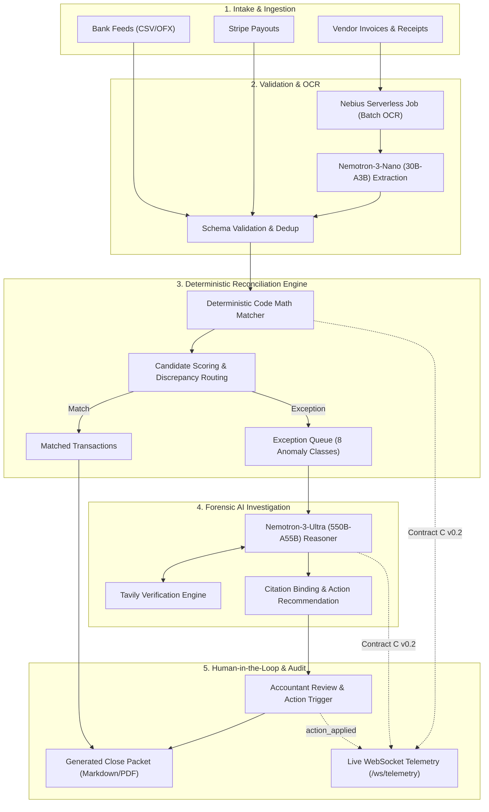

# CloseProof: Autonomous Forensic Financial Reconciliation

[](https://opensource.org/licenses/Apache-2.0)
[](https://python.org)
[](https://fastapi.tiangolo.com)
[](https://nextjs.org)
[](https://www.nvidia.com)
[](https://nebius.com)

CloseProof is an enterprise-grade autonomous month-end close and forensic reconciliation platform. Combining deterministic code-level mathematical reconciliation with dual-tier NVIDIA Nemotron reasoning models and live cited web enrichment, CloseProof turns painful, multi-day month-end financial reviews into a verifiable, audit-ready closing workflow.

> 📖 **Complete Walkthrough:** For a 10-minute guide explaining how CloseProof works, the 5 human actions, the 8 anomaly classes, and full developer onboarding, see the [CloseProof Complete User Guide](docs/USER_GUIDE.md).

---

## The Principle: "Proof, Not Ledger Edits"

Traditional automated accounting tools fail in enterprise environments because they attempt to "auto-fix" or silently edit ledger records. When an unexplainable mismatch occurs, silent ledger mutations break audit trails and violate SOX compliance.

**CloseProof operates under a strict principle: Proof, Not Ledger Edits.**
- CloseProof **never silently modifies, alters, or overrides general ledger entries**.
- Every reconciliation transaction is evaluated through deterministic code math.
- Discrepancies and anomalies are preserved and surfaced with complete evidence lineage.
- The forensic reasoning engine generates human-verifiable explanations backed by concrete citations (original source document IDs and verified external regulatory URLs).
- The human accountant retains full executive discretion to apply actions (`approve_match`, `write_off`, `request_receipt`, `contact_vendor`, `escalate_accountant`).
- The output is an immutable, auditor-ready **Close Packet** markdown document with an unbroken chain of custody.

---

## Hackathon Stack Highlights

CloseProof is engineered from the ground up to leverage the bleeding-edge NVIDIA and Nebius AI infrastructure:

| Component | Technology | Purpose |
| :--- | :--- | :--- |
| **Forensic Explanation Engine** | **NVIDIA Nemotron-3-Ultra (550B-A55B)** | Analyzes complex reconciliation exceptions, evaluates multi-candidate evidence, detects root causes, and recommends accountant remediation actions with strict citation constraints. |
| **Extraction & Normalization Tier** | **NVIDIA Nemotron-3-Nano (30B-A3B)** | High-throughput parsing of unstructured invoices, receipts, and merchant statements into structured JSON entities with sub-second latency. |
| **High-Performance Inference** | **Nebius Token Factory** | OpenAI-compatible serverless inference endpoint delivering enterprise throughput, high token concurrency, and low latency for large parameter models. |
| **Batch Document Processing** | **Nebius Serverless Jobs** | Distributed batch execution for multi-page receipt OCR, document chunking, and PDF ledger extraction without infrastructure overhead. |
| **Live Grounding & Verification** | **Tavily Search API** | Autonomous targeted lookups for official vendor fee schedules, merchant receipt portals, and corporate registration validation. Strictly forbids hallucinated citations. |
| **Deterministic Math Engine** | **Python Core Ledger** | Deterministic float-safe mathematical matching, candidate ranking, and confidence scoring. Code math, not probabilistic hallucination, decides balances. |
| **Mission Control Telemetry** | **FastAPI WebSockets + SSE** | Live Contract C v0.2 telemetry streaming event envelopes (`feed_ingested`, `recon_match`, `recon_exception`, `explain_done`, `tavily_lookup`, `action_applied`, `packet_ready`). |
| **Executive Interface** | **Next.js 14, React & Tailwind CSS** | Real-time mission control UI with live pipeline cards, forensic evidence drawer, interactive action triggers, and one-click Close Packet export. |

---

## System Architecture



### Telemetry Side Rail (Contract C v0.2)
Every lifecycle transition emits a standardized JSON envelope across WebSocket `/ws/telemetry` and REST `/api/runs/{run_id}/events`:
```json
{
  "project": "closeproof",
  "event": "explain_done",
  "run_id": "99f8d9b2",
  "ts": 1727958921000,
  "severity": "info",
  "payload": {
    "item_id": "exc_bank_fee_147",
    "model_tier": "ultra",
    "confidence": 0.90,
    "human_action": "write_off"
  }
}
```

---

## Quickstart & Local Setup

### Prerequisites
- Python 3.11+
- Node.js 18+ and `npm`
- Nebius Token Factory API key
- Tavily Search API key

### 1. Clone & Environment Setup
```bash
git clone https://github.com/your-org/closeproof.git
cd closeproof

# Create and activate Python virtual environment
python -m venv .venv
source .venv/bin/activate       # macOS/Linux
# or: .venv\Scripts\activate   # Windows

# Install Python dependencies
pip install -r requirements.txt
```

### 2. Configure Environment Variables
Copy `.env.example` to `.env` and fill in your credentials:
```bash
cp .env.example .env
```
Ensure your `.env` contains:
```env
NEBIUS_API_KEY=your_nebius_token_factory_key
TAVILY_API_KEY=your_tavily_api_key
NEBIUS_MODEL_ULTRA=nvidia/Nemotron-3-Ultra-550b-a55b
NEBIUS_MODEL_NANO=nvidia/NVIDIA-Nemotron-3-Nano-30B-A3B
```
*(For offline or automated testing without live API keys, set `NEBIUS_MOCK=1`)*

### 3. Run the Backend API Server
```bash
# macOS / Linux (with venv activated):
uvicorn api.main:app --reload --port 8000

# Windows (Command Prompt / PowerShell):
python -m uvicorn api.main:app --reload --port 8000
# or direct executable path:
.venv\Scripts\python.exe -m uvicorn api.main:app --reload --port 8000
```
Interactive OpenAPI documentation will be available at [http://localhost:8000/docs](http://localhost:8000/docs).

### 4. Run the Web Frontend (Next.js)
In a separate terminal window:
```bash
cd web
npm install
npm run dev
```
Open [http://localhost:3000](http://localhost:3000) to access the CloseProof Mission Control interface.

### 5. Run Verification & Evaluation Suite
```bash
# Run unit tests across reconciliation, packet generator, and API
pytest eval/

# Run complete 5-group QA and Integration Harness (with mock mode fallback)
python eval/harness.py
```

---

## QA & Evaluation Harness

CloseProof features a comprehensive automated evaluation harness in [`eval/harness.py`](file:///eval/harness.py) validating five strict criteria:

1. **Anomaly Detection Truth-Table**: Validates detection of all 8 financial anomaly classes (`DUP-STRIPE`, `FEE-147`, `MISSING-RECEIPT`, `VENDOR-VARIANT`, `FX-ROUND`, `ORPHAN-INVOICE`, `PERSONAL`, `REFUND-SPLIT`) with exact matching `human_action` mappings.
2. **Reconciliation Precision & Recall**: Enforces deterministic matching precision and recall $\ge 0.95$.
3. **Citation Integrity & Anti-Hallucination**: Verifies that every exception carries $\ge 1$ verified citation, and strictly zero invented or fabricated `doc_id` references.
4. **Close Packet Completeness**: Asserts that every exception ID appears in the generated Close Packet markdown and that dollar totals equal the underlying ledger sum.
5. **Contract C v0.2 Telemetry Schema**: Asserts that 100% of emitted envelopes match the strict JSON contract schema (including `action_applied`).

---

## Synthetic Data & Provenance Note

All demo data fixtures located in [`fixtures/loader.py`](file:///fixtures/loader.py) and [`fixtures/anomalies.md`](file:///fixtures/anomalies.md) are entirely **synthetic and programmatically generated**. They are intentionally crafted to model realistic financial discrepancies (FX rounding differences, bank fee debits, duplicate merchant payouts, missing itemized receipts) without containing real customer PII, confidential company financials, or live banking credentials.

---

## Enterprise Roadmap

CloseProof is designed for seamless enterprise adoption:
- **Corporate Bank Feeds**: Native ingestion pipelines for standard corporate formats including **BAI2**, **MT940**, and **CAMT.053 (ISO 20022 XML)** for multi-bank global treasury reconciliation.
- **Enterprise ERP Hooks**: Bi-directional connectors for **NetSuite SuiteTalk (REST/SOAP)** and **SAP OData ERP APIs**, allowing accountants to sync approved reconciliation adjustments, journal entries, and close packets directly into general ledger software with full audit signoff.
- **Multi-Entity & Intercompany**: Cross-currency FX revaluation matching and automatic elimination of intercompany balances.

---

## License

CloseProof is open-source software licensed under the **[Apache License 2.0](LICENSE)**.